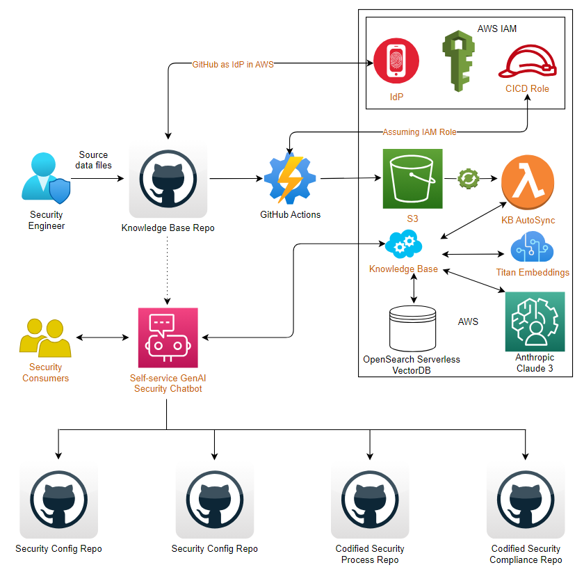

# Exploring Generative AI in Security

## GenAI Powered Security Self-Service Chatbot

### Introduction

This proof-of-concept (PoC) investigates the application of generative AI within the realm of security enablement and self-service. The primary objective is to harness the capabilities of generative AI alongside front-end chatbots to enhance the user experience for security consumers, particularly in extensive enterprise settings. By equipping these chatbots with specialized security knowledge, they can educate and mentor users on security principles, protocols, and procedures, ultimately facilitating their ability to independently address their security needs through GitOps workflows, such as managing git pull requests. While Cloudflare serves as an example of security technology utilized in this PoC, this methodology is broadly applicable across various self-service workflows that involve coding security configurations, compliance, and governance processes onto a version control system.

### High Level Solution Architecture

### References

- [GenAI Powered Security Self-Service Chatbot Blog](https://trantdai.github.io/blog/genai-security-selfservice-chatbot)