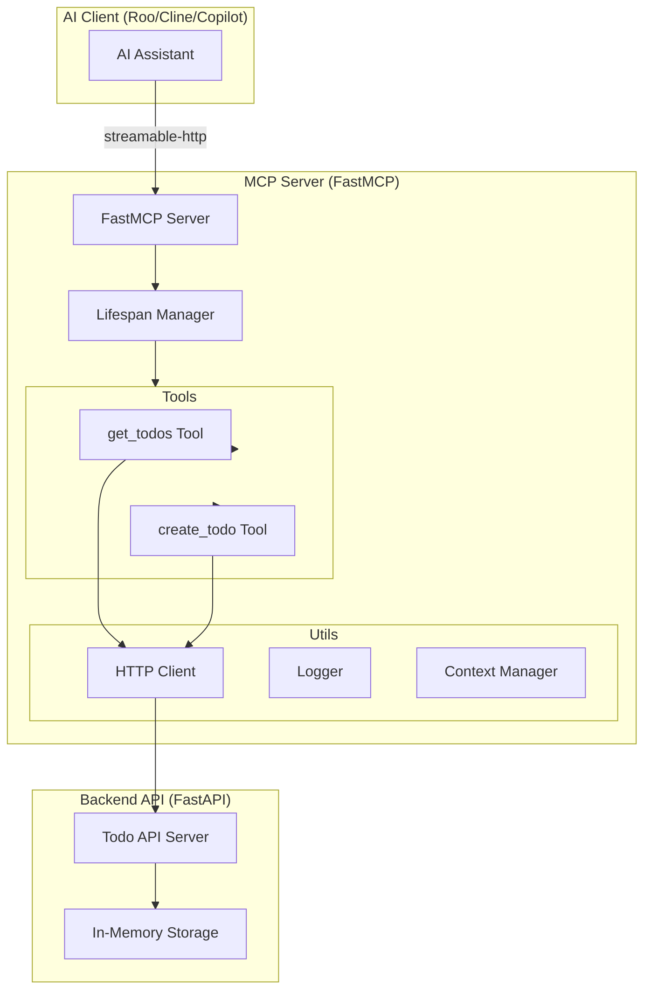

# Todo MCP Server - Learning Project Architecture Plan

## 🎯 Project Overview

This is a learning-focused project to gain hands-on experience developing an MCP (Model Context Protocol) server following best practices. The project implements a simple Todo API with one GET method and one POST method, wrapped in a FastMCP server with streamable-http transport.

### Learning Objectives
- Understand FastMCP framework architecture
- Implement streamable-http transport (modern MCP standard)
- Follow modern development patterns and conventions
- Practice dynamic tool discovery and registration
- Learn MCP server deployment and configuration

---

## 📋 API Specification

### Simple Todo API

#### Base URL
```
http://localhost:8000/api
```

#### Endpoints

##### 1. GET /todos
**Description**: Retrieve a list of todos with optional filtering

**Query Parameters**:
- `limit` (optional, integer, default: 10): Maximum number of todos to return
- `status` (optional, string): Filter by status (`pending`, `completed`, `all`)
- `search` (optional, string): Search todos by title

**Response** (200 OK):
```json
{
  "todos": [
    {
      "id": "1",
      "title": "Learn FastMCP",
      "description": "Study FastMCP framework documentation",
      "status": "pending",
      "created_at": "2026-01-02T10:00:00Z",
      "updated_at": "2026-01-02T10:00:00Z"
    }
  ],
  "total": 1,
  "limit": 10,
  "offset": 0
}
```

##### 2. POST /todos
**Description**: Create a new todo item

**Request Body**:
```json
{
  "title": "New Todo",
  "description": "Todo description",
  "status": "pending"
}
```

**Response** (201 Created):
```json
{
  "id": "2",
  "title": "New Todo",
  "description": "Todo description",
  "status": "pending",
  "created_at": "2026-01-02T11:00:00Z",
  "updated_at": "2026-01-02T11:00:00Z"
}
```

**Error Response** (400 Bad Request):
```json
{
  "error": "Invalid request",
  "message": "Title is required"
}
```

---

## 🏗️ MCP Server Architecture

### Architecture Diagram



### Component Breakdown

#### 1. FastMCP Server Core
- **Purpose**: Main MCP server instance handling protocol communication
- **Transport**: Streamable-HTTP (modern standard, replacing SSE)
- **Responsibilities**:
  - Handle MCP protocol messages
  - Manage tool registration and discovery
  - Provide context to tools
  - Stream responses to clients

#### 2. Lifespan Manager
- **Purpose**: Manage server startup and shutdown lifecycle
- **Responsibilities**:
  - Initialize HTTP client on startup
  - Configure logging and context
  - Register tools dynamically
  - Clean up resources on shutdown

#### 3. Tool Registry
- **Purpose**: Dynamic tool discovery and registration
- **Pattern**: Follows CBA's dynamic tool discovery pattern
- **Responsibilities**:
  - Scan tools directory
  - Register tools with FastMCP
  - Provide tool metadata to clients

#### 4. MCP Tools

##### get_todos Tool
```python
@mcp.tool()
async def get_todos(
    limit: int = 10,
    status: str = "all",
    search: Optional[str] = None,
    ctx: Context = None
) -> dict:
    """
    Retrieve todos from the Todo API.

    Args:
        limit: Maximum number of todos to return (default: 10)
        status: Filter by status - pending, completed, or all (default: all)
        search: Optional search term to filter todos by title
        ctx: MCP context (injected automatically)

    Returns:
        Dictionary containing todos list and metadata
    """
```

##### create_todo Tool
```python
@mcp.tool()
async def create_todo(
    title: str,
    description: str = "",
    status: str = "pending",
    ctx: Context = None
) -> dict:
    """
    Create a new todo item.

    Args:
        title: Todo title (required)
        description: Todo description (optional)
        status: Initial status - pending or completed (default: pending)
        ctx: MCP context (injected automatically)

    Returns:
        Dictionary containing the created todo item
    """
```

#### 5. Backend API (FastAPI)
- **Purpose**: Simple REST API for todo operations
- **Storage**: In-memory list (for learning purposes)
- **Responsibilities**:
  - Handle HTTP requests
  - Validate input data
  - Manage todo storage
  - Return JSON responses

---

## 📁 Project Structure

```
todo-mcp-server/
├── README.md                          # Project documentation
├── requirements.txt                   # Python dependencies
├── .env.example                       # Environment variables template
├── .gitignore                        # Git ignore rules
│
├── src/
│   ├── todo_mcp_server/
│   │   ├── __init__.py
│   │   ├── version.py                # Version information
│   │   ├── server.py                 # FastMCP server setup
│   │   ├── cli.py                    # Command-line interface
│   │   │
│   │   ├── tools/
│   │   │   ├── __init__.py
│   │   │   ├── get_todos.py         # GET todos tool
│   │   │   ├── create_todo.py       # POST todo tool
│   │   │   └── dynamic_tools.py     # Dynamic tool registration
│   │   │
│   │   ├── utils/
│   │   │   ├── __init__.py
│   │   │   ├── http_client.py       # HTTP client for API calls
│   │   │   ├── logger.py            # Logging configuration
│   │   │   └── context.py           # Context management
│   │   │
│   │   └── api/
│   │       ├── __init__.py
│   │       ├── main.py              # FastAPI application
│   │       ├── models.py            # Pydantic models
│   │       └── storage.py           # In-memory storage
│   │
├── tests/
│   ├── __init__.py
│   ├── test_tools.py                # Tool tests
│   ├── test_api.py                  # API tests
│   └── test_integration.py          # Integration tests
│
├── docs/
│   ├── getting-started.md           # Getting started guide
│   ├── architecture.md              # Architecture documentation
│   ├── api-reference.md             # API reference
│   └── deployment.md                # Deployment guide
│
└── examples/
    ├── client-config.json           # Example MCP client config
    └── test-requests.md             # Example API requests
```

---

## 🔧 Technology Stack

### Core Dependencies
- **FastMCP** (`mcp[cli]`): MCP server framework
- **FastAPI**: Backend REST API framework
- **httpx**: Async HTTP client for API calls
- **pydantic**: Data validation and settings
- **python-dotenv**: Environment variable management
- **uvicorn**: ASGI server for FastAPI

### Development Dependencies
- **pytest**: Testing framework
- **pytest-asyncio**: Async test support
- **pytest-mock**: Mocking support
- **black**: Code formatting
- **ruff**: Linting

---

## 🔐 Security Considerations

### For Learning Environment
1. **No Authentication Required**: Simplified for learning
2. **In-Memory Storage**: No persistent data
3. **Local Development Only**: Not production-ready

### For Production Enhancement (Future)
1. **API Key Authentication**: Add API key validation
2. **Rate Limiting**: Prevent abuse
3. **Input Validation**: Comprehensive validation with Pydantic
4. **CORS Configuration**: Proper CORS headers
5. **HTTPS**: TLS/SSL encryption
6. **Database**: Persistent storage with proper security

---

## 🚀 Implementation Phases

### Phase 1: Backend API Setup
**Goal**: Create the simple Todo REST API

**Tasks**:
1. Set up FastAPI application structure
2. Define Pydantic models for Todo items
3. Implement in-memory storage
4. Create GET /todos endpoint with filtering
5. Create POST /todos endpoint with validation
6. Add error handling and logging
7. Test API endpoints manually

**Deliverables**:
- Working FastAPI application
- API documentation (auto-generated by FastAPI)
- Basic tests

### Phase 2: FastMCP Server Core
**Goal**: Set up FastMCP server with streamable-http transport

**Tasks**:
1. Create FastMCP server instance
2. Implement lifespan manager
3. Configure streamable-http transport
4. Set up logging and context management
5. Create HTTP client utility
6. Test server initialization

**Deliverables**:
- FastMCP server that starts successfully
- Lifespan management working
- HTTP client configured

### Phase 3: MCP Tools Implementation
**Goal**: Create MCP tools for GET and POST operations

**Tasks**:
1. Implement [`get_todos`](src/todo_mcp_server/tools/get_todos.py:1) tool
2. Implement [`create_todo`](src/todo_mcp_server/tools/create_todo.py:1) tool
3. Add dynamic tool registration
4. Test tools with execute-tool command
5. Add comprehensive error handling
6. Document tool usage

**Deliverables**:
- Two working MCP tools
- Dynamic tool discovery
- Tool documentation

### Phase 4: Integration & Testing
**Goal**: Ensure all components work together

**Tasks**:
1. Write unit tests for tools
2. Write integration tests
3. Test with MCP client (Roo/Cline)
4. Add example configurations
5. Create troubleshooting guide

**Deliverables**:
- Comprehensive test suite
- Working client configurations
- Integration verified

### Phase 5: Documentation & Polish
**Goal**: Create comprehensive documentation

**Tasks**:
1. Write getting started guide
2. Document architecture decisions
3. Create API reference
4. Add deployment instructions
5. Include learning notes and insights
6. Create example use cases

**Deliverables**:
- Complete documentation
- Example configurations
- Learning summary

---

## 🧪 Testing Strategy

### Unit Tests
- Test individual tools in isolation
- Mock HTTP client responses
- Validate input/output handling
- Test error scenarios

### Integration Tests
- Test FastMCP server startup
- Test tool registration
- Test API communication
- Test end-to-end workflows

### Manual Testing
- Test with Roo Code
- Test with Cline
- Test with GitHub Copilot
- Verify streamable-http transport

---

## 📊 Key Learning Points

### 1. FastMCP Framework
- How FastMCP simplifies MCP server development
- Automatic tool registration and discovery
- Context management and dependency injection
- Lifespan management patterns

### 2. Streamable-HTTP Transport
- Why streamable-http replaced SSE
- How to configure streamable-http
- Benefits: single endpoint, better reliability
- Client configuration differences

### 3. Dynamic Tool Discovery
- Python module introspection
- Automatic tool registration
- Tool metadata and documentation
- Tool versioning considerations

### 4. Best Practices
- Project structure conventions
- Logging and monitoring patterns
- Error handling standards
- Documentation requirements

### 5. MCP Protocol
- Tool calling patterns
- Context passing
- Response formatting
- Error handling

---

## 🔄 Future Enhancements

### Short Term
1. Add UPDATE (PUT/PATCH) operation
2. Add DELETE operation
3. Add pagination support
4. Add sorting capabilities

### Medium Term
1. Add persistent storage (SQLite/PostgreSQL)
2. Add authentication (API keys)
3. Add rate limiting
4. Deploy to DHP (DevOps Hosting Platform)

### Long Term
1. Add WebSocket support for real-time updates
2. Add multi-user support
3. Add todo categories/tags
4. Add due dates and reminders
5. Create web UI for todo management

---

## 📚 Reference Materials

### External Resources
- [Model Context Protocol Specification](https://modelcontextprotocol.io)
- [FastMCP Documentation](https://github.com/jlowin/fastmcp)
- [FastAPI Documentation](https://fastapi.tiangolo.com)
- [MCP Python SDK](https://github.com/modelcontextprotocol/python-sdk)
- [Docker Documentation](https://docs.docker.com/)
- [Python Best Practices](https://docs.python-guide.org/)

---

## 🎓 Success Criteria

### Technical Success
- ✅ FastMCP server starts successfully
- ✅ Streamable-http transport configured
- ✅ Both tools (GET/POST) working
- ✅ Dynamic tool discovery functional
- ✅ Integration with AI clients verified
- ✅ All tests passing

### Learning Success
- ✅ Understand FastMCP architecture
- ✅ Understand streamable-http transport
- ✅ Can create new MCP tools independently
- ✅ Can deploy and configure MCP servers
- ✅ Can troubleshoot common issues
- ✅ Can extend with new features

---

## 🚦 Next Steps

1. **Review this plan** and provide feedback
2. **Clarify any questions** about the architecture
3. **Approve the plan** to proceed with implementation
4. **Switch to Code mode** to start building

Would you like me to:
- Add more details to any section?
- Modify the API specification?
- Change the project structure?
- Add additional features?
